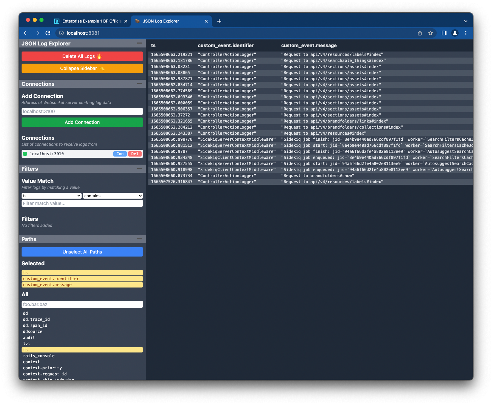

# JSON Log Explorer

A UI for exploring JSON logs.



## Install

No funny stuff, Lebowski.

1. Download and extract
   ```
    mkdir ~/json-log-explorer
    cd ~/json-log-explorer
    wget https://github.com/corytheboyd-smartsheet/json-log-explorer/releases/latest/download/json-log-explorer.tar.gz
    tar -xf json-log-explorer.tar.gz
    rm json-log-explorer.tar.gz
    ```
2. Run the JSON Log Explorer web app:
    ```
   # cd ~/json-log-explorer
   bin/server -port 8081 -address localhost
   # 2022/10/11 15:37:48 Starting server: address=`localhost:8081` publicPath=`/Users/cboyd/json-log-explorer/public`
   ```
3. Open address in browser http://localhost:8081

## Development

Release a new build:

1. Increment `VERSION.txt`
2. Run scripts
   ```
   bin/build
   
   # Must have `gh` CLI installed and authorized to run release script
   bin/release
   ```
